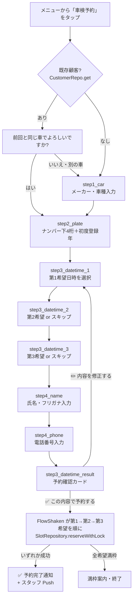
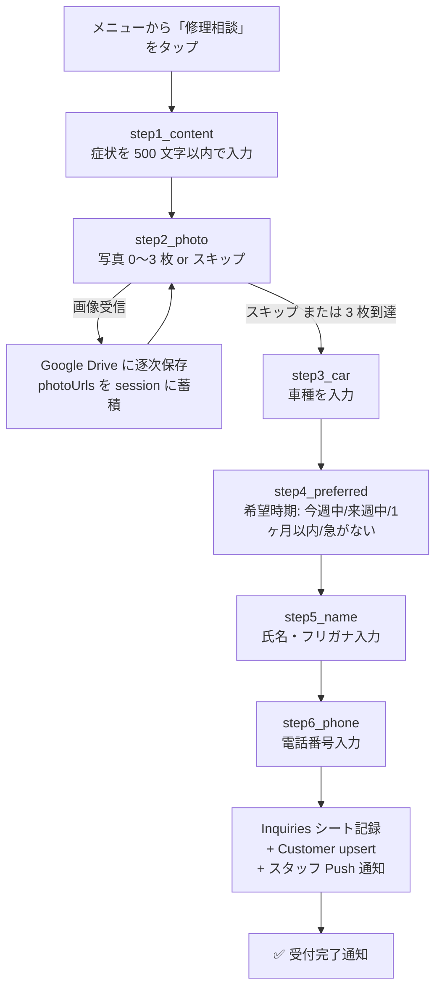
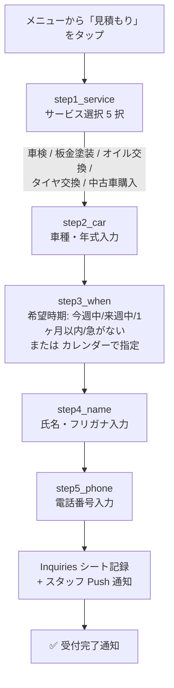
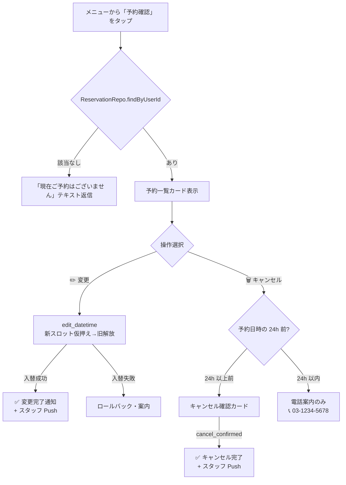

# gas-line-reservation-bot

**自動車整備サービス向け LINE 公式アカウント Bot**（サンプル実装）。Google Apps Script + Google Sheets + LINE Messaging API で構築した、車検予約・修理相談・見積もり依頼・予約確認を LINE トーク内で完結させる自動応答ボット。サーバ不要・追加コストほぼゼロ。

> **Status**: サンプル実装（実装デモ用）
> **Author**: tanasato — [restartory.com](https://restartory.com)
> **公開範囲**: 全コード公開（クライアント識別情報は匿名化済み）

---

## なぜ作ったか

地方の自動車整備工場では、電話受付が営業時間内のみで取りこぼしが発生し、Web フォームは PC 慣れしていない顧客が使いこなせない、という二重の課題があった。一方、LINE は普及率が高く、ボタン中心の操作で高齢層も使いやすい。**LINE トーク内だけで予約から確認まで完結する仕組み**を作れば、24 時間受付化と取りこぼし削減を両立できると考えた。

サーバ運用コストと開発工数を最小化するため、**Google Apps Script + Google Sheets** という非エンジニアでも保守しやすい構成を選択している。

## できること

### メイン機能（4 本柱）

- **🚗 車検予約**: 第 1〜第 3 希望の日時を選んで車検をオンライン予約
- **🔧 修理相談**: 症状 + 写真（最大 3 枚）+ 希望時期で依頼を送信
- **💰 見積もり**: サービス・車種・希望時期を伝えて概算依頼
- **📋 予約確認**: 既存予約の一覧表示・変更・キャンセル

### 補助機能

- 📞 電話案内（Flex Message + ワンタップ発信）
- 📍 営業情報（住所・営業時間・地図リンク）
- ❓ ヘルプ（全機能の使い方ガイド）
- 👤 採用応募フロー

### 設計上の特徴

- **意図マッチング**: 「車検したい」「エンジンから異音」など自然言語キーワードからフローを起動
- **複数希望日時対応**: 第 1〜第 3 希望を別々に選択可能
- **画像アップロード対応**: LINE で送られた写真を Google Drive に保存し、シートにリンク
- **Push Quota Guard**: 月次 Push 通数の閾値（140/180/200）でアラート
- **Session Timeout**: 30 分操作なしで自動的にセッションを破棄

## 技術スタック

| カテゴリ | 採用技術 |
|---|---|
| 言語 | JavaScript（Google Apps Script） |
| サーバ / ランタイム | Google Apps Script V8 |
| DB / ストレージ | Google スプレッドシート（カスタムシート 8 枚） |
| メッセージング API | LINE Messaging API（Webhook） |
| UI | LINE Flex Message + リッチメニュー + クイックリプライ |
| 認証 | Webhook 署名検証（HMAC-SHA256） |
| デプロイ | clasp（Google Apps Script CLI） |

## アーキテクチャ

```
┌─────────────┐
│ LINE ユーザー  │
└──────┬──────┘
       │ メッセージ / 画像 / postback
       ▼
┌─────────────────────┐
│ LINE Messaging API   │
└──────┬──────────────┘
       │ Webhook（署名検証）
       ▼
┌──────────────────────────────────────────────┐
│ Google Apps Script Web App                   │
│ ┌─────────────────────────────────────────┐ │
│ │ Main.gs（Webhook ルーティング）           │ │
│ └─────┬───────────────────────────────────┘ │
│       │                                     │
│ ┌─────▼─────┬─────────┬─────────┬─────────┐│
│ │ FlowShaken│ FlowRepair│ FlowEstimate│FlowManage││
│ │ (車検予約) │ (修理相談) │ (見積)      │(予約確認)││
│ └─────┬─────┴─────┬───┴─────┬───┴─────┬───┘│
│       │           │         │         │     │
│ ┌─────▼───────────▼─────────▼─────────▼───┐ │
│ │ SessionManager（30 分 TTL）              │ │
│ │ Security（入力検証 / 署名検証）           │ │
│ │ PushQuotaGuard（月次 Push 上限管理）      │ │
│ │ FlexMessages（カード生成）                │ │
│ │ LineClient（API 呼び出し）                │ │
│ └─────┬───────────────────────────────────┘ │
└───────┼─────────────────────────────────────┘
        │ openById()
        ▼
┌─────────────────────────┐
│ Google スプレッドシート     │
│ ├ Reservations（予約）   │
│ ├ Inquiries（問い合わせ） │
│ ├ Customers（顧客）       │
│ ├ Recruit（採用応募）     │
│ └ Slots（予約枠）         │
└─────────────────────────┘
```

## セットアップ

### 1. Google Apps Script プロジェクト作成

1. [Google Apps Script](https://script.google.com/) で新規プロジェクト作成
2. このリポジトリの `gas/*.gs` を全てコピー
3. `appsscript.json` をコピーしマニフェスト設定を反映

### 2. Script Properties 設定

GAS エディタの **プロジェクト設定 → スクリプトプロパティ** で以下を設定（`.env.example` 参照）:

| キー | 必須 | 用途 |
|---|:---:|---|
| `LINE_CHANNEL_SECRET` | ✅ | LINE Webhook 署名検証用 |
| `LINE_CHANNEL_ACCESS_TOKEN` | ✅ | LINE Push / Reply 送信用 |
| `SPREADSHEET_ID` | ✅ | データ保存用スプレッドシート ID |
| `STAFF_LINE_USER_ID` | 任意 | スタッフへのアラート Push 通知先 |
| `PRIVACY_POLICY_URL` | 任意 | プライバシーポリシーページの URL |

### 3. スプレッドシート初期化

GAS エディタで `SetupSheets.setupAll()` を一度実行すると、必要なシート（Reservations / Inquiries / Customers / Recruit / Slots / Logs / Quota / Sessions）が自動生成される。

### 4. Webhook 設定

1. Google Apps Script を **ウェブアプリとしてデプロイ**（アクセス: 全員、実行: 自分）
2. 生成された URL を [LINE Developers Console](https://developers.line.biz/) の Webhook URL に登録
3. Webhook 検証 → ON

### 5. リッチメニュー作成（任意）

GAS エディタで `RichMenuSetup.setup()` を実行するとリッチメニューが自動作成される。

## 動作デモ

LINE トーク内で以下のフローが自動応答で動作します。各図は実装（`gas/Flow*.gs`）の state machine と一対一で対応します。

### 🚗 車検予約フロー（FlowShaken）



### 🔧 修理相談フロー（FlowRepair）



### 💰 見積もりフロー（FlowEstimate）



### 📋 予約確認フロー（FlowManage）



### サンプル会話（車検予約）

実際の LINE Bot のメッセージ・ボタンラベルを `gas/FlowShaken.gs` `gas/FlexMessages.gs` から逐語抽出（個人情報はサンプル値）。

```
ユーザー: 車検したい

Bot: 車検するお車のメーカー・車種を教えてください（例: トヨタ プリウス）

ユーザー: ホンダ N-BOX

Bot: ナンバープレートの下4桁と、初度登録年（西暦4桁）を教えてください。

     ▼入力形式
       ナンバー4桁（半角スペース）西暦4桁

     ▼例
       1234 2018
       ・1234 → ナンバー下4桁
       ・2018 → 初度登録年（車検証に記載）

ユーザー: 5678 2020

Bot: 第1希望の日時を選んでください。
     [ 明日 10:00 ] [ 明日 14:00 ] [ 来週月曜 10:00 ] [ キャンセル ] [📅 カレンダーから選ぶ]

     ※テキスト入力でも「2/20 15:00」「明日 10:00」「来週月曜 14時」など柔軟に解釈（DateTimeParser）。

ユーザー: [ 来週月曜 10:00 をタップ ]

Bot: 第2希望の日時を選んでください（任意）。
     [ 明日 10:00 ] [ 明日 14:00 ] [ 来週月曜 10:00 ] [⏭ ここまでの希望で予約する] [ キャンセル ]

ユーザー: [ ⏭ ここまでの希望で予約する ]

Bot: お名前（フルネーム）を教えてください。
     漢字のお名前とフリガナの両方が必要です。

ユーザー: 山田 太郎 ヤマダ タロウ

Bot: お電話番号を教えてください（例: 090-1234-5678）

ユーザー: 080-1234-5678

Bot: ✅ ご予約内容をご確認ください
     ━━━━━━━━━━━━━━━━━━━
     サービス: 車検
     第1希望: 来週月曜 10:00
     お車: ホンダ N-BOX (5678 / 2020 年登録)
     お名前: 山田 太郎 (ヤマダ タロウ)
     お電話: 080-1234-5678
     ━━━━━━━━━━━━━━━━━━━
     [✅ この内容で予約する] [✏️ 内容を修正する]

ユーザー: [ ✅ この内容で予約する ]

Bot: ✅ 車検予約が完了しました。
     ご予約日時にお待ちしております。
```

> **電話番号について**: 上記サンプルおよびソース内の `03-1234-5678` `090-1234-5678` 等はダミー値です。実際のクライアント案件で使用する際は実番号に差し替えてください。

### サンプル会話（修理相談）

実際のメッセージは `gas/FlowRepair.gs` から逐語抽出（個人情報はサンプル値）。

```
ユーザー: エンジンから異音

Bot: 修理のご相談を承ります。どのような症状か教えてください（500文字以内）

ユーザー: 朝の始動時にカラカラ音、走行中は治る

Bot: 写真があれば送信してください（最大3枚）。不要の場合は「スキップ」と入力
     [ スキップ ]

ユーザー: [ 画像を 1 枚送信 ]

Bot: 写真1枚目を受け取りました。追加で送るか「スキップ」で次へ
     [ スキップ ]

ユーザー: [ スキップ ]

Bot: お車の車種を教えてください（例: トヨタ プリウス）

ユーザー: ホンダ N-BOX

Bot: いつ頃の修理をご希望ですか?
     [ 今週中 ] [ 来週中 ] [ 1ヶ月以内 ] [ 急がない ] [📅 カレンダー]

ユーザー: [ 今週中 ]

Bot: お名前（フルネーム）を教えてください。
     漢字のお名前とフリガナの両方が必要です。

ユーザー: 山田 太郎 ヤマダ タロウ

Bot: お電話番号を教えてください（例: 090-1234-5678）

ユーザー: 080-1234-5678

Bot: 受付が完了しました。担当者から営業時間内にご連絡いたします。
```

### 実機スクリーンショット

GitHub 上の Mermaid 図 + サンプル会話（コードから逐語抽出）でロジックは追えますが、実画面の視覚的な「動く証拠」は別途用意中。`docs/screenshots/` に LINE トーク・リッチメニューの匿名化スクショを順次追加予定（NDA 配慮で店名・スタッフ名・売上数値はモザイク）。

## 工夫点・技術的判断

### 1. Script Properties での秘密情報管理

LINE Channel Secret / Access Token / Spreadsheet ID は全て `Config.gs` 経由で `PropertiesService` から取得し、ソースコードに一切書かない。これにより GAS をパブリックに公開しても秘密情報が漏れない。

### 2. Webhook 署名検証

`Security.gs` で LINE が送信する `X-Line-Signature` ヘッダを HMAC-SHA256 で検証。署名不一致のリクエストは即座に拒否することで、不正な Webhook 呼び出しを防ぐ。

### 3. Push Quota Guard

LINE Messaging API の月次 Push 通数（無料 200 通 / Lite プラン 15,000 通）を超えると追加料金が発生するため、`PushQuotaGuard.gs` が閾値（140/180/200）でアラートを発し、上限を超えそうになったら `canPush()` が false を返して Push を抑制する。

### 4. Session Manager（30 分 TTL）

予約フロー中の状態遷移を `SessionManager.gs` で管理し、30 分操作なしで自動破棄。これにより「途中で離脱して 1 週間後にメニューと言ったら昔のフローが復活する」事故を防ぐ。

### 5. 入力検証の集約

電話番号・氏名・自由記述のバリデーションは `Security.gs` に集約。各フローから `Security.validatePhone(text)` `validateFreeText(text, 100)` のように呼ぶ。

## 成果・指標（サンプル運用想定）

| 指標 | 想定 Before | 想定 After |
|---|---|---|
| 受付時間 | 営業時間（9:00〜18:00） | **24 時間受付** |
| 取りこぼし率（時間外） | 推定 30%（業界平均） | **0%** |
| 予約 1 件あたりの電話対応工数 | 平均 5 分 | **0 分（自動応答）** |
| サーバ運用コスト | — | **0 円**（GAS 無料枠 + LINE 無料プランで完結可、規模に応じてライトプラン月 5,000 円） |

## この実績が武器になる案件

- **LINE 公式アカウント Bot 構築**: 予約・問い合わせ・採用応募などの定型フロー自動化
- **小規模事業者向けサーバレス業務システム**: GAS + Google Sheets で本格的な業務システムを最小コストで構築
- **マルチフロー会話型 UI**: 予約・修理・見積・採用など複数のフローを 1 つの Bot で並行管理する設計

特に**地方の中小事業者**（自動車整備・美容室・歯科・整骨院・設備修理など）で、LINE 経由の予約が必要だが IT 投資余力が限られる業種で転用可能。

## 注意

- 本リポジトリは**サンプル実装**です。クライアント案件で使用する場合は、Privacy Policy・利用規約・お問い合わせフォームの整備を別途行ってください。
- LINE Messaging API の利用規約・Google Apps Script の利用規約に従って運用してください。

## ライセンス

MIT License — 自由に流用・改変可能。商用利用も歓迎します。

---

> **So what** — この実装は「**24 時間 LINE 自動受付システム**を**サーバゼロ運用コスト**で構築できる」という証明。地方中小事業者の予約取りこぼし課題を、追加コストほぼゼロで解決できる手札として、特に**自動車整備・美容・医療・設備修理**などの予約型 BtoC サービス案件で武器になる。
